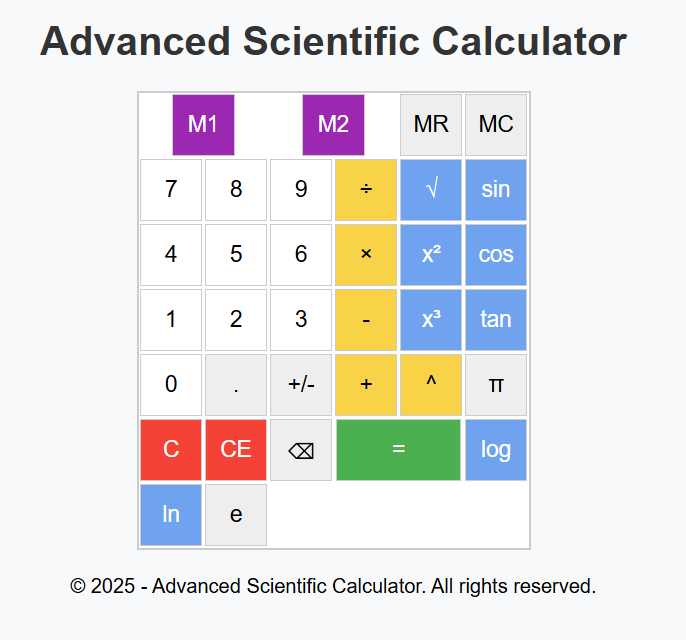

# Advanced Scientific Calculator

An advanced, responsive scientific calculator built with **HTML** and **CSS**. Includes trigonometric functions, memory storage, and advanced operations like exponents and logarithms. Ideal for students and professionals.

## 🔧 Features

- Basic operations: addition, subtraction, multiplication, division
- Advanced functions:  
  √, x², x³, exponent (^), log, ln  
- Trigonometric functions:  
  sin, cos, tan  
- Constants: π (pi), e  
- Memory functions: M1, M2, MR (Memory Recall), MC (Memory Clear)  
- Backspace, CE (Clear Entry), and C (Clear All)
- Responsive layout for mobile and desktop

## 🖼 Preview



## 📁 Project Structure

advanced-scientific-calculator/

├── index.html # Main HTML file

├── styles/

 └── style.css # CSS styling

├── images/

 └── screenshot.png # Calculator screenshot

└── README.md # Project documentation

## 🚀 How to Use

1. Clone the repository:
   ```bash
   git clone https://github.com/sperlido/advanced-scientific-calculator.git

2. Open index.html in your browser:
    ```bash
    open index.html

## 📜 License
This project is open source and free to use. You can add a specific license (MIT, GPL, etc.) if needed.

## 👨‍💻 Author
Created by Sperlido, 2025.
Feel free to contribute or suggest improvements.
